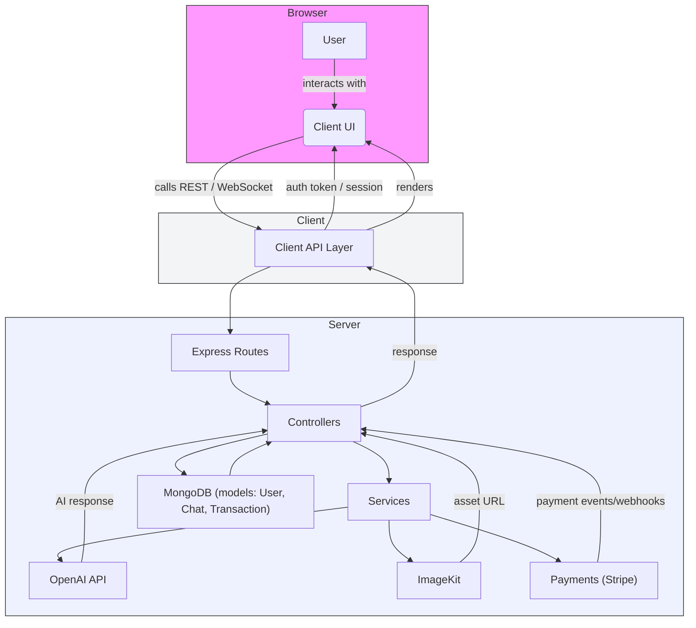

# Nexus AI

**Nexus AI** is a full-stack prototype that pairs a React + Vite client with an Express/MongoDB server to provide a chat experience backed by the OpenAI API and auxiliary services (image uploads, payments, webhooks). It is structured for local development and easy deployment, with Vercel configuration included.

**Architecture Flowchart**

Below is a high-level flowchart illustrating how the pieces of Nexus AI interact. The diagram uses Mermaid syntax — many markdown renderers (and GitHub) can display this directly.



**Key Features:**

- **Chat interface:** React-based UI for chatting with an AI assistant.
- **Persistent storage:** MongoDB models for users, chats, and transactions.
- **OpenAI integration:** Server-side usage of the OpenAI SDK for generating responses.
- **Image uploads:** ImageKit integration for handling image assets.
- **Payments & credits:** Stripe (or similar) hooks for credit/transaction handling and webhooks.

**Repository layout**

- [client](client/): React + Vite front-end (UI components, pages, styles).
- [server](server/): Express API, controllers, routes, models, and service integrations.
- [server/configs/db.js](server/configs/db.js): MongoDB connection helper.
- [server/server.js](server/server.js): Express app entrypoint.

**Prerequisites**

- Node.js (recommended v18+)
- npm or yarn
- MongoDB (connection string for a hosted DB like MongoDB Atlas or local instance)
- OpenAI API key and other third-party service credentials (ImageKit, Stripe, etc.)

**Environment variables**

Create a `.env` file in the `server` directory. Typical variables include:

- `PORT` — port for Express server (default 3000)
- `MONGO_URI` — MongoDB connection string
- `JWT_SECRET` — JSON Web Token secret for auth
- `OPENAI_API_KEY` — OpenAI API key
- `IMAGEKIT_PUBLIC_KEY`, `IMAGEKIT_PRIVATE_KEY`, `IMAGEKIT_URL_ENDPOINT` — ImageKit credentials
- `STRIPE_SECRET_KEY` — Stripe secret key (if payments enabled)

Check the actual variable names and usage in [server/configs/db.js](server/configs/db.js) and other files under [server/configs](server/configs).

**Development**

Install dependencies for both client and server, then run them.

_Server (API)_

1. Change into the server folder and install dependencies:

   ```bash
   cd server
   npm install
   ```

2. Run the server in development (uses `nodemon`) or start directly:

   ```bash
   npm run server   # nodemon server.js (auto-reloads)
   npm start        # node server.js
   ```

The server entry point is [server/server.js](server/server.js). Routes are defined in [server/routes](server/routes).

_Client (React + Vite)_

1. Change into the client folder and install dependencies:

   ```bash
   cd client
   npm install
   ```

2. Run the Vite dev server:

   ```bash
   npm run dev
   ```

The client app entry is [client/src/main.jsx](client/src/main.jsx) and the main UI lives in [client/src/App.jsx](client/src/App.jsx).

**Available scripts**

- Server scripts (`server`, `start`): see [server/package.json](server/package.json)
- Client scripts (`dev`, `build`, `preview`, `lint`): see [client/package.json](client/package.json)

**API & Routes (overview)**

- Chat: implemented in [server/routes/chatRoutes.js](server/routes/chatRoutes.js)
- Credits / Payments: implemented in [server/routes/creditRoutes.js](server/routes/creditRoutes.js)
- Messages: implemented in [server/routes/messageRoutes.js](server/routes/messageRoutes.js)
- Users & auth: implemented in [server/routes/userRoutes.js](server/routes/userRoutes.js)

Controllers and business logic live under [server/controllers](server/controllers). Models are in [server/models](server/models).

**Testing**

This repository does not include a test harness by default. You can add tests (Jest, Vitest, etc.) as required.

**Deployment**

The repository contains `vercel.json` configuration files and is prepared for a typical Vercel deployment. Configure environment variables in your Vercel project settings and point the client and server deployments appropriately.

**Security & Best Practices**

- Keep secrets out of source control — use environment variables or a secrets manager.
- Do not expose `OPENAI_API_KEY`, `JWT_SECRET`, or payment keys in client-side code.
- Validate and sanitize user input on the server side.

**Contributing**

Fork the repo, create a feature branch, and open a pull request with a clear description. Keep changes focused and add or update documentation when introducing new features.

**Troubleshooting**

- If the server cannot connect to MongoDB, verify `MONGO_URI` and network access to your DB provider.
- If OpenAI calls fail, confirm `OPENAI_API_KEY` is valid and the account has sufficient usage quota.

**Useful links (in-repo)**

- Project client: [client](client/)
- Project server: [server](server/)
- Server entrypoint: [server/server.js](server/server.js)
- Server DB config: [server/configs/db.js](server/configs/db.js)

**License**

This project does not include a license file by default. Add a `LICENSE` file if you intend to publish under a specific license.
